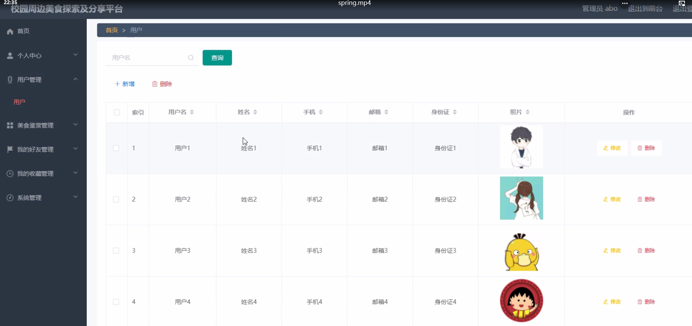

**项目简介：**  
本项目基于主流的前后端分离架构，采用 **SpringBoot + Vue 技术栈**，配套 **MySQL 数据库**，适用于毕业设计与课题实训开发。  
本人已整理了超 **4000 多套毕业设计源码+论文+开题报告+PPT...**，涵盖 **Java、SpringBoot、Vue、SSM、uni-app 小程序、PHP、Android** 等方向，支持功能修改定制与论文服务。  
**团队提供以下服务：**  
- 项目代码修改与调试  
- 数据库配置与远程协助  
- 论文定制与修改  
**获取更多的4000多套源码或SQL文件请联系：**  
- QQ：3906443360 微信：BesheHelp

# springboot021校园周边美食探索及分享平台的设计与实现

4.1前台首页功能模块

校园周边美食探索及分享平台，在系统首页可以查看首页、美食鉴赏、我的好友、个人中心、后台管理等内容，如图4-1所示。

图4-1前台首页功能界面图

用户登录、用户注册，在用户注册页面可以填写用户名、姓名、手机、邮箱、身份证等详细内容进行注册、登录，如图4-2所示。

图4-2 用户注册、用户登录界面图

美食鉴赏，在美食鉴赏页面查看发布时间、美食名称、美食类别、美食介绍、商品所在、推荐指数、美食照片、商品价格、用户名、姓名、美食介绍等信息进行点赞、评论，也可根据需要美食鉴赏名称进行搜索操作，如图4-3所示。

图4-3美食鉴赏界面图

个人中心，在个人中心页面通过填写用户名、姓名、手机、邮箱、身份证、照片等信息进行添加、修改、删除进行更改操作，如图4-4所示。

图4-3个人中心界面图

4.3用户功能模块

用户登录进入校园周边美食探索及分享平台可以查看首页、个人中心、美食鉴赏管理、我的好友管理、我的收藏管理等内容。如图4-5所示。

图4-5首页界面图

个人中心，用户在个人信息页面中可以查看用户名、姓名、手机、邮箱、身份证、照片等信息内容，并且根据需要对已有个人信息进行查看或删除等其他详细操作，如图4-6所示。

图4-6个人信息界面图

美食鉴赏管理，用户在美食鉴赏页面中可以添加发布时间、美食名称、美食类别、美食介绍、商品所在、推荐指数、美食照片、商品价格、用户名、姓名、美食介绍等信息内容，可进行修改或删除等其他详细操作，如图4-7所示。

图4-7美食鉴赏管理界面图

我的收藏管理，用户可以收藏美食名称、美食图片等查看或删除等其他详细操作，如图4-8所示。

图4-8我的收藏管理界面图

4.2管理员功能模块

管理员登录，通过填写注册时输入的用户名、密码、角色进行登录，如图4-9所示。

图4-9管理员登录界面图

管理员登录进入校园周边美食探索及分享平台可以查看首页、个人中心、用户管理、美食鉴赏管理、我的好友管理、我的收藏管理、系统管理等信息。如图4-7所示。

管理员对个人中心进行操作填写原密码、新密码、确认密码并进行添加、删除、修改以及查看，如图4-10所示。

图4-10首页界面图

图4-11密码修改界面图

用户管理，管理员在用户信息页面中可以查看用户名、姓名、手机、邮箱、身份证、照片等信息，并可根据需要对已有用户信息进行修改或删除等操作，如图4-12所示。

图4-12用户信息界面图

美食鉴赏管理，管理员在美食鉴赏信息页面中可以查看发布时间、美食名称、美食类别、美食介绍、商品所在、推荐指数、美食照片、商品价格、用户名、姓名、美食介绍等信息，并可根据需要对已有美食鉴赏信息进行新增、修改或删除等详细操作，如图4-13所示。

图4-13美食鉴赏信息界面图

我的好友管理，在我的好友页面中可以查看用户名、姓名、添加时间等内容，并且根据需要对已有我的好友进行新增、修改或删除等详细操作，如图4-14所示。

图4-14我的好友界面图

系统管理:管理员通过系统管理页面查看轮播图进行上传图片进行添加、删除、修改以及查看并对整个系统进行维护等操作。，如图4-15所示。

图4-15系统管理界面图

第五章  软件测试

测试存在于软件开发进程中的最后一个阶段，它可以保证一个软件的开发质量是否符合设计者的初衷，也为程序的正式上线做了最后一道质量检测的工序。软件测试主要是控制各种条件、包括软件输出方式，使用模式和运行环境等，来评估一个系统或应用是否符合设计标准。在软件测试过程中，我们一般刻意的去制造错误和极端条件，不能仅依照正常模式允许，而是多去尝试那些意外的情况。

5.1软件测试的重要性

只有在运行和维护阶段之前经历大量的测试的软件，才能说明它的质量是经得起检验的。最近计算机业界也都一致认为，测试应该存在于软件设计的每个阶段，因为越早发现错误，修复起来就越容易。

实际上，对于一个软件应用，错误是必然存在的，无论使用何种技术或手段，都不可能绝对的排除软件漏洞。测试是随着软件开发一同诞生的，两者是共同发展进步的。实际上，测试可以大幅度的降低维护的成本，如果一个漏洞在开发的早期就被发现，那么修复它的成本远比上线后再修复的成本要低得多。

5.2测试实例的研究与选择

测试有白盒测试和黑盒测试两种方式。